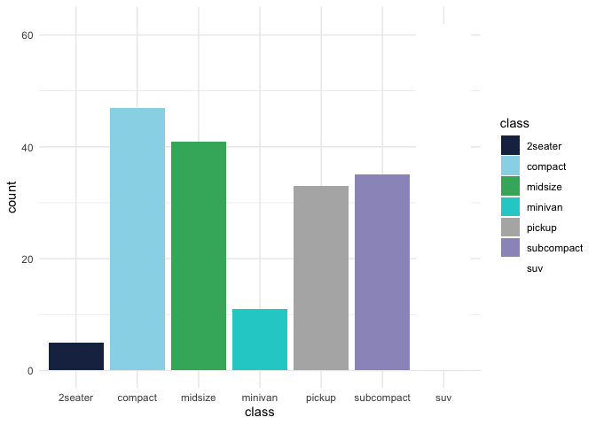
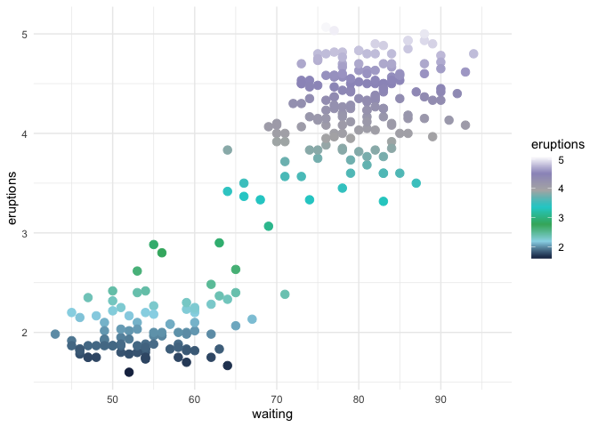

README
================


The `seababel` package uses colors inspired by the SeaBABEL lab to
provide a custom discrete and continuous color palette designed for use
with base R or `ggplot2` visualizations.

------------------------------------------------------------------------

## Installation

You can install the development version of `seababel` from GitHub using:

``` r
# install.packages("devtools") devtools::install_github("faithfrings/seababel")
```

## Examples

``` r
library(ggplot2) 
library(seababel)
```

### Discrete color palette

``` r
ggplot(mpg, aes(x = class, fill = class)) + 
  geom_bar() + 
  scale_fill_seababel(discrete = TRUE) + 
  theme_minimal() 
```

<!-- -->

## Continuous color palette

``` r
ggplot(faithful, aes(x = waiting, y = eruptions, color = eruptions)) + geom_point(size = 3) + scale_color_seababel(discrete = FALSE) + theme_minimal()
```

<!-- -->
